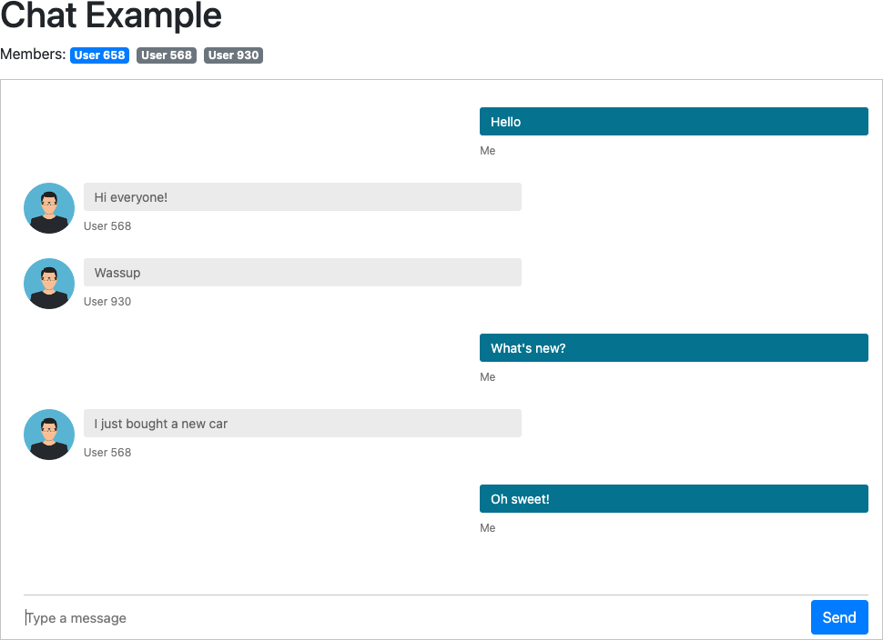

# Pusher Chat

A chat room example built on Pusher for real-time messaging.

Uses presence channels to allow multiple users to chat at the same time and client events to communicate directly without a middle-man server running (except for auth).

Built on Node.js for the backend and React for the frontend.



## Setup

Sign up to [Pusher](https://pusher.com/) and create a free account.

Enable client events in app settings.

## Install

Backend:
```bash
cd backend
npm install
cp .env.default .env
nano .env # fill in the Pusher config
npm start
```

Frontend (run in a seperate tab):
```bash
cd frontend
npm install
cp .env .env.local
nano .env.local # fill in the Pusher config
npm run dev
```

Visit http://localhost:5173/ (open multiple browser tabs to simulate multiple users).

## Persistence

If you need to persist messages, add a webhook in Pusher (triggered by client events) and point to the backend server `/pusher/webhook` endpoint.